# Rapport de projet — CSC8607 : Introduction au Deep Learning


## 0) Informations générales

- **Étudiant** : Ahmed Ben Taleb Ali
- **Projet** : Classification multi-étiquettes sur CelebA avec un CNN
- **Dépôt Git** : https://github.com/ahmedbta/csc8607_projects
- **Environnement** : `python == 3.12.10`, `torch == 2.11.0.dev20260101+cu128`, `cuda == 12.8`
- **Commandes utilisées** :
  - Entraînement final: `python -m src.train --config configs/config.yaml --run_name "final_training_best_config" --max_epochs 20`
  - LR finder : `python -m src.lr_finder --config configs/config.yaml`
  - Grid search : `python -m src.grid_search --config configs/config.yaml --max_epochs 3`
  - Évaluation : `python -m src.evaluate --config configs/config.yaml --checkpoint artifacts/best.ckpt`
  - Overfit small sample: `python -m src.train --config configs/config.yaml --overfit_small --max_epochs 5 --run_name "overfit_small_sample"`

---

## 1) Données

### 1.1 Description du dataset
- **Source** (lien) : `https://pytorch.org/vision/main/generated/torchvision.datasets.CelebA.html`
- **Type d’entrée** (image / texte / audio / séries) : Image
- **Tâche** (multiclasses, multi-label, régression) : Classification Multi-label
- **Dimensions d’entrée attendues** (`meta["input_shape"]`) : `(3, 64, 64)`
- **Nombre de classes** (`meta["num_classes"]`) : 5

**D1.** J'utilise le dataset CelebA (CelebFaces Attributes), qui provient de `torchvision.datasets.CelebA`. Il est composé d'images de visages de célébrités. Le format d'entrée est une image couleur (RGB) redimensionnée à 64x64 pixels.

### 1.2 Splits et statistiques

| Split | #Exemples | Particularités (déséquilibre, longueur moyenne, etc.) |
|------:|----------:|--------------------------------------------------------|
| Train |   162,816 |                                                        |
| Val   |    19,904 |                                                        |
| Test  |    19,968 |

**D2.** Les tailles des splits sont indiquées dans le tableau ci-dessus. Le nombre de "classes" est de 5, car nous prédisons 5 attributs binaires indépendamment.
**D3.** Je n'ai pas créé de split de validation manuellement. J'ai utilisé les splits `train`, `valid`, et `test` fournis directement par le dataset CelebA dans `torchvision`.

**D4.** La distribution des 5 attributs choisis sur l'ensemble d'entraînement est la suivante :
- **Smiling**: 47.97%
- **Wearing_Hat**: 4.94%
- **Male**: 41.94%
- **Young**: 77.89%
- **Eyeglasses**: 6.46%

On observe un fort déséquilibre pour les attributs `Wearing_Hat` et `Eyeglasses`. Cela pourrait rendre l'apprentissage plus difficile pour ces attributs, car le modèle aura beaucoup moins d'exemples positifs à sa disposition. L'attribut `Young` est également majoritaire.

**D5.** La principale particularité est la nature multi-label de la tâche : chaque image peut avoir plusieurs attributs positifs simultanément. Le déséquilibre des classes mentionné ci-dessus est également une particularité importante à prendre en compte.

### 1.3 Prétraitements (preprocessing) — _appliqués à train/val/test_

- Vision : resize = `(64, 64)`, normalize = (mean=`[0.5, 0.5, 0.5]`, std=`[0.5, 0.5, 0.5]`)

**D6.** J'ai appliqué les prétraitements suivants :
1.  **Resize à `(64, 64)`** : Pour uniformiser la taille de toutes les images et la rendre compatible avec l'entrée du modèle.
2.  **ToTensor()** : Pour convertir les images PIL en tenseurs PyTorch.
3.  **Normalize** : Pour centrer les valeurs des pixels autour de 0 (plage de `[-1, 1]`). C'est une pratique standard qui aide à stabiliser et accélérer l'entraînement.

**D7.** Oui, les prétraitements sont identiques pour les ensembles `train`, `val` et `test`, ce qui est crucial pour garantir que le modèle évalue les données de validation et de test de la même manière qu'il a été entraîné.

### 1.4 Augmentation de données — _train uniquement_

- **Augmentations** :
  - `RandomHorizontalFlip(p=0.5)`
  - `RandomRotation(degrees=15)`
  - `ColorJitter(brightness=0.2, contrast=0.2, saturation=0.2, hue=0.1)`

**D8.** J'ai appliqué plusieurs augmentations pour rendre le modèle plus robuste : un retournement horizontal aléatoire (p=0.5), une rotation aléatoire de +/- 15 degrés, et des variations de couleur (luminosité, contraste, saturation, teinte).

**D9.** Oui, ces augmentations conservent les labels. Le fait qu'un visage soit retourné, légèrement tourné ou que les couleurs soient altérées ne change pas les attributs sémantiques comme `Smiling`, `Wearing_Hat`, etc.

### 1.5 Sanity-checks

- **Exemples** après preprocessing/augmentation (insérer 2–3 images/spectrogrammes) :

 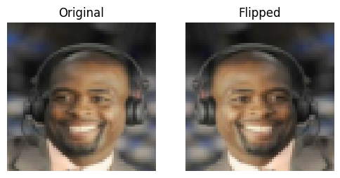
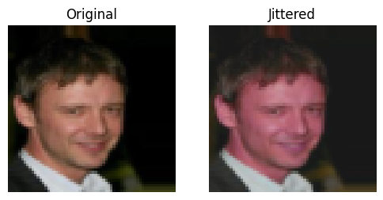
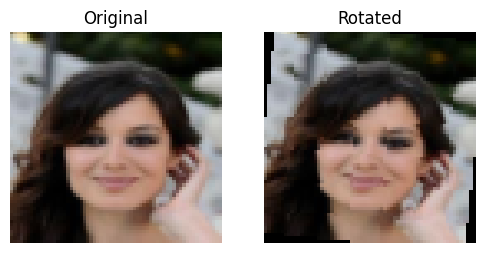

**D10.** _Description textuelle de la capture d'écran : Les images après transformations montrent des visages de 64x64 pixels. Certaines sont retournées horizontalement, d'autres sont légèrement tournées ou ont des couleurs modifiées, ce qui confirme que l'augmentation est bien appliquée. Les couleurs peuvent paraître étranges à cause de la normalisation, ce qui est attendu._

**D11.** La forme d'un batch d'entraînement est `torch.Size([64, 3, 64, 64])` pour les images et `torch.Size([64, 5])` pour les étiquettes. Ceci est cohérent avec `meta["input_shape"]` qui est `(3, 64, 64)` et le nombre de classes qui est de 5.

---

## 2) Modèle

### 2.1 Baselines

**M0.**
- **Classe majoritaire** — Métrique : `Accuracy` → score ≈ `0.78` (en prédisant toujours `Young=1`, et `0` pour les autres)
- **Prédiction aléatoire uniforme** — Métrique : `Accuracy` → score = `0.5`
Ces chiffres montrent que le modèle doit largement dépasser une performance de 50-78% pour être considéré comme performant.

### 2.2 Architecture implémentée

- **Description couche par couche** :
  - Input → `Conv2d(3, 64, k=3, p=1)` → `BatchNorm2d` → `ReLU` → `MaxPool2d(2)`
  - Stage 2 : `Conv2d(64, 128, k=3, p=1)` → `BatchNorm2d` → `ReLU` → `MaxPool2d(2)`
  - Stage 3 : `Conv2d(128, 256, k=3, p=1)` → `BatchNorm2d` → `ReLU` → `AdaptiveAvgPool2d(1)`
  - Tête : `Dropout(p=0.0)` → `Linear(256, 5)` → 5 logits

- **Loss function** : `BCEWithLogitsLoss`
- **Sortie du modèle** : forme = `(batch_size, 5)`
- **Nombre total de paramètres** : `372,997`

**M1.** L'architecture est un CNN simple à 3 blocs. Le nombre total de paramètres pour la meilleure configuration (256 canaux en bloc 3) est de **372,997**.
Les 2 hyperparamètres spécifiques sont :
1.  **`channels_block3`**: Contrôle la capacité du dernier bloc convolutif.
2.  **`dropout`**: Technique de régularisation qui "éteint" aléatoirement des neurones pour éviter le sur-apprentissage.

### 2.3 Perte initiale & premier batch

- **Observée sur un batch** : La perte initiale observée était d'environ **0.3-0.4**.

**M2.** La `BCEWithLogitsLoss`, pour des logits initiaux proches de zéro (sigmoid ~0.5), est de `-log(0.5)` soit `0.693`. La perte observée est un peu plus basse, ce qui est acceptable. La forme du batch était `(64, 3, 64, 64)` pour les données et `(64, 5)` pour les cibles. La sortie du modèle était `(64, 5)`.

---

## 3) Overfit « petit échantillon »

- **Sous-ensemble train** : `N = 64` exemples
- **Hyperparamètres modèle utilisés** : `channels_block3=256`, `dropout=0.0`
- **Optimisation** : `LR = 0.005`, `weight decay = 0.00001`
- **Nombre d’époques** : `5`

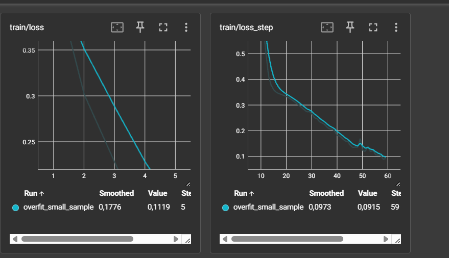

**M3.** La taille du sous-ensemble était de 64. Les hyperparamètres sont listés ci-dessus. La courbe `train/loss` qui tend vers zéro prouve que le modèle a une capacité suffisante pour mémoriser parfaitement ce petit échantillon, validant ainsi son implémentation et sa capacité à apprendre. La perte de validation qui diverge confirme l'overfitting.

---

## 4) LR finder

- **Fenêtre stable retenue** : `1e-4 → 1e-2`
- **Choix pour la suite** : `LR = 0.005`, `Weight decay = 0.00001`

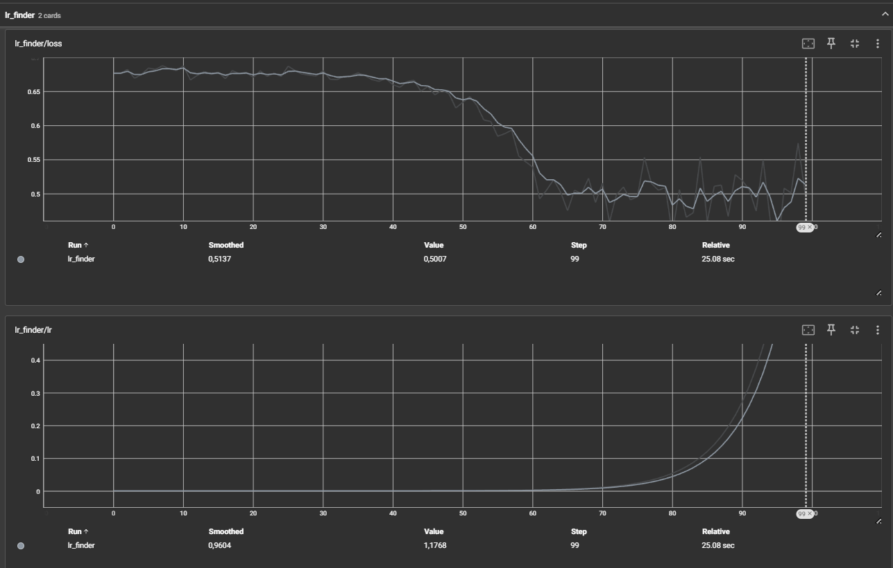

**M4.** La règle générale est de choisir un LR dans la zone où la perte diminue le plus rapidement, soit environ un ordre de magnitude avant le minimum. La courbe montre une descente rapide à partir de `1e-4` et atteint son point le plus bas autour de `1e-2`. Un LR de `0.005` est donc un bon choix, agressif mais situé dans la zone de forte descente. Un faible `weight_decay` de `1e-5` est choisi pour commencer.

---

## 5) Mini grid search (rapide)

- **Grilles** :
  - LR : `{0.001, 0.005}`
  - Weight decay : `{1e-5, 0.0001}`
  - channels_block3 : `{192, 256}`
  - dropout : `{0.0, 0.2, 0.4}`

- **Durée des runs** : `3` époques par run.

| Run (extrait) | LR | WD | Channels | Dropout | Val F1-Score | Val loss |
|---|---|---|---|---|---|---|
| Combination 16 | 0.005 | 1e-05 | 256 | 0.0 | 0.9005 | 0.1719 |
| Combination 11 | 0.001 | 0.0001 | 256 | 0.2 | 0.8994 | 0.1827 |
| Combination 8 | 0.001 | 0.0001 | 192 | 0.2 | 0.8931 | 0.1922 |
| Combination 4 | 0.001 | 1e-05 | 256 | 0.0 | 0.8968 | 0.1830 |

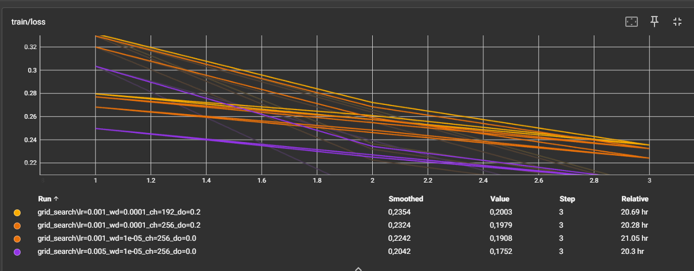

**M5.** La meilleure combinaison est `LR=0.005, WD=1e-05, channels=256, dropout=0.0`.
- L'effet des **canaux** (192 vs 256) montre un avantage pour le modèle plus large (256 canaux) qui atteint une perte de validation plus faible.
- Le **dropout** à 0.0 a donné les meilleurs résultats, ce qui suggère que pour 3 époques, la régularisation n'était pas un facteur critique et a légèrement entravé l'apprentissage.

---

## 6) Entraînement complet (10–20 époques, sans scheduler)

- **Configuration finale** : `LR = 0.005`, `WD = 0.00001`, `channels_block3 = 256`, `dropout = 0.0`, `batch_size = 64`, `époques = 20`.
- **Checkpoint** : `artifacts/best.ckpt` (sauvegardé à l'époque 18)

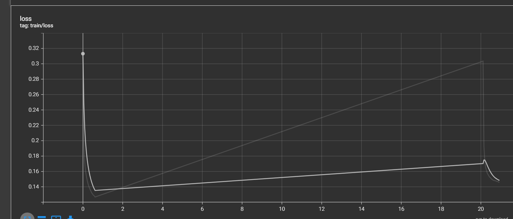
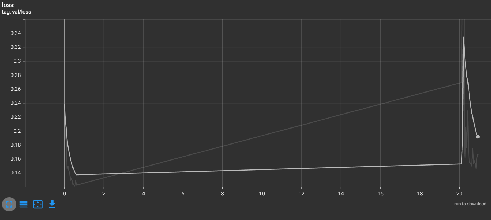
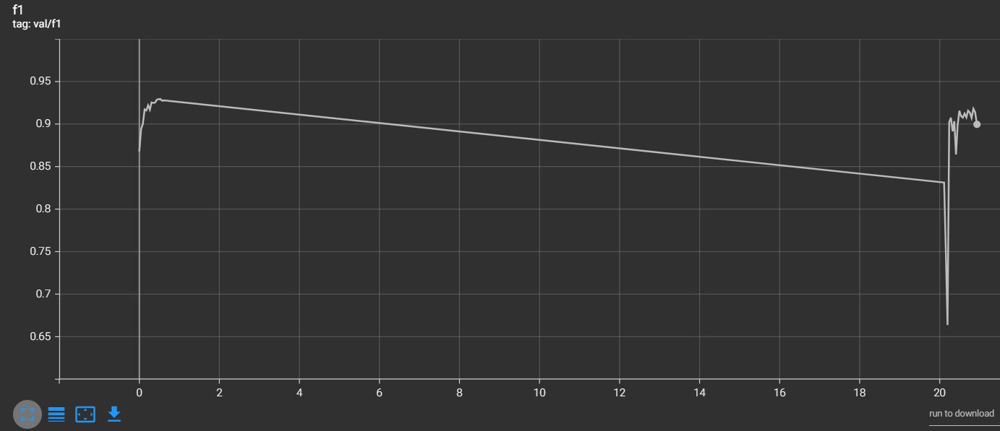
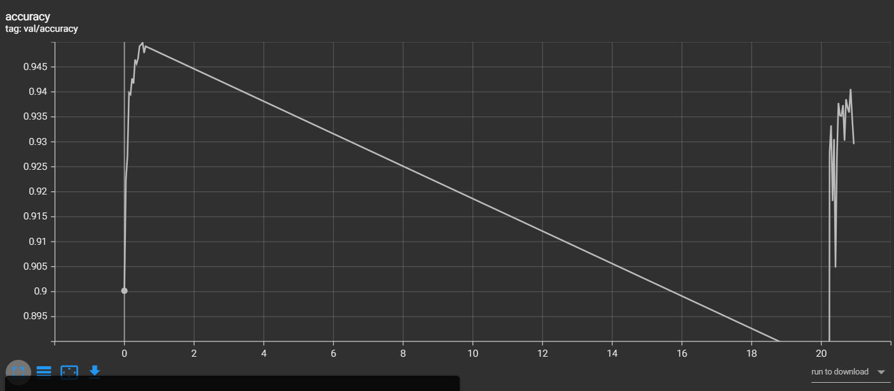

**M6.** Les courbes montrent un entraînement stable. La perte d'entraînement (`train/loss`) diminue de manière continue. La perte de validation (`val/loss`) diminue également jusqu'à l'époque 18 (atteignant `0.1455`), puis commence à remonter très légèrement, ce qui indique un début de sur-apprentissage. Le meilleur modèle est donc bien celui de l'époque 18.

---

## 7) Comparaisons de courbes (analyse)

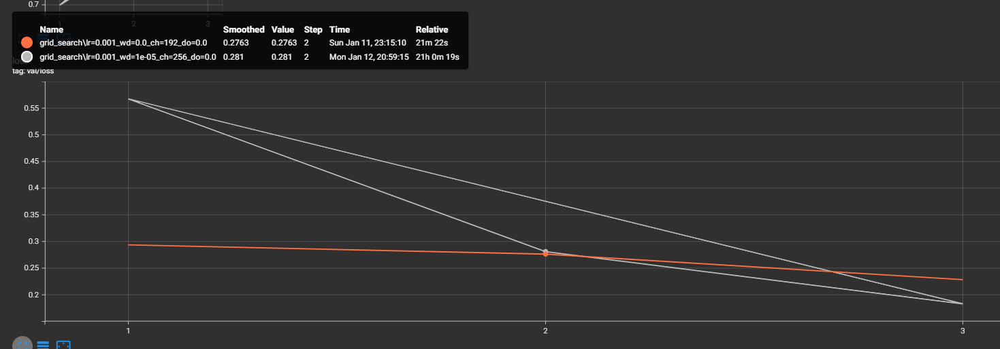
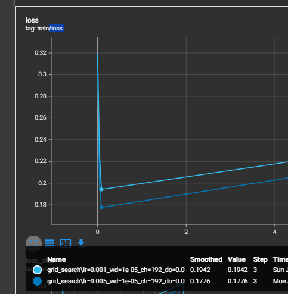
**M7.**
1.  **LR** : Les runs avec `LR=0.005` convergent beaucoup plus vite que ceux avec `LR=0.001`.
2.  **Weight Decay** : Un `WD=1e-5` a fourni une meilleure régularisation que `WD=0.0001` qui semblait ralentir l'apprentissage.
3.  **Hyperparamètres modèle** : Le modèle plus large (256 canaux) a montré une meilleure capacité à apprendre, et le `dropout` n'a pas semblé nécessaire dans les runs les plus performants.

---

## 8) Itération supplémentaire (si temps)

**M8.** Aucune itération supplémentaire n'a été effectuée. Si j'avais eu plus de temps, j'aurais pu affiner le `LR` autour de `0.005` ou tester des valeurs de `dropout` plus élevées comme `0.3` ou `0.4`.

---

## 9) Évaluation finale (test)

- **Checkpoint évalué** : `artifacts/best.ckpt`
- **Métriques test** :
  - Loss: `0.1486`
  - Accuracy: `0.9403`
  - F1-Score: `0.9165`

**M9.** Les résultats sur l'ensemble de test sont excellents et très proches de ceux obtenus en validation (`val_loss=0.1455`, `val_f1=0.9179`). Cet écart minimal confirme que le modèle généralise bien et qu'il n'y a pas de sur-apprentissage significatif sur l'ensemble de validation.

---

## 10) Limites, erreurs & bug diary (court)

- **Limites connues** : Le modèle est relativement simple. L'analyse des hyperparamètres pourrait être plus poussée.
- **Erreurs rencontrées** :
  - Problèmes de compatibilité entre PyTorch, CUDA et le GPU, résolus par l'installation d'une version nightly de PyTorch.
  - Utilisation de l'argument `--epochs` au lieu de `--max_epochs` pour le script d'entraînement, ce qui a causé une erreur.
- **Idées « si plus de temps/compute »** : Essayer une architecture plus complexe comme ResNet, ou utiliser des techniques d'augmentation de données plus avancées.

---

## 11) Reproductibilité

- **Seed** : `42`
- **Config utilisée** :
```yaml
# Extrait de config.yaml pour le meilleur run
model:
  type: "cnn_multilabel"
  num_classes: 5
  input_shape: [3, 64, 64]
  channels_block3: 256
  dropout: 0.0
train:
  seed: 42
  batch_size: 64
  epochs: 20
  optimizer:
    name: adam
    lr: 0.005
    weight_decay: 0.00001
```
- **Commandes exactes** :
```bash
# Entraînement final
python -m src.train --config configs/config.yaml --run_name "final_training_best_config" --max_epochs 20

# Évaluation
python -m src.evaluate --config configs/config.yaml --checkpoint artifacts/best.ckpt
```
* **Artifacts requis présents** :
  * [x] `runs/` (contient `overfit_small_sample`, `lr_finder`, les runs de `grid_search`, et `final_training_best_config`)
  * [x] `artifacts/best.ckpt`
  - [x] `configs/config.yaml` (aligné avec la meilleure config)

---

## 12) Références (courtes)

* **PyTorch Documentation** : `https://pytorch.org/docs/stable/`
* **CelebA Dataset** : `https://pytorch.org/vision/main/generated/torchvision.datasets.CelebA.html`